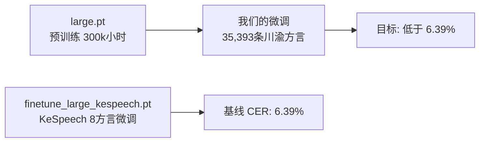

# Data2Vec 详解

> TeleSpeech-ASR 使用的预训练架构，基于 Meta 的 data2vec 论文

---

## 一、data2vec 是什么

data2vec 是 Meta（Facebook AI）提出的**通用自监督学习框架**。核心理念：用同一种方法，同时处理语音、图像、文本三种模态。

在它之前：
- wav2vec 2.0：专做语音
- BEiT / MAE：专做图像
- BERT：专做文本

data2vec 把三者统一了：**"预测教师模型给出的隐层表示"**。

---

## 二、核心思想：师生框架（Teacher-Student）

```
┌──────────────────────────────────────────────────────────┐
│                    Data2Vec 训练流程                       │
├──────────────────────────────────────────────────────────┤
│                                                          │
│   输入音频 x                                              │
│      │                                                   │
│      ├──→ Student（学生模型）                              │
│      │    ├── 输入：被 mask 过的音频特征                     │
│      │    ├── Transformer Encoder                        │
│      │    └── 输出：预测的隐层表示                          │
│      │                                                   │
│      └──→ Teacher（教师模型）                              │
│           ├── 输入：完整未 mask 的音频特征                   │
│           ├── 与 Student 结构相同                          │
│           └── 输出：目标隐层表示（作为 Student 的学习目标）     │
│                                                          │
│    Loss = MSE(Student输出, Teacher输出)                    │
│                                                          │
│    Teacher 不通过梯度更新！                                  │
│    用 EMA（指数移动平均）从 Student 权重缓慢更新              │
│                                                          │
└──────────────────────────────────────────────────────────┘
```

### 关键点

1. **Teacher 不做梯度更新** — 而是通过 EMA 从 Student 慢慢"滑过去"
2. **EMA 更新公式**：
   ```
   θ_teacher = τ × θ_teacher + (1-τ) × θ_student
   ```
   其中 τ 从 0.9997 逐渐线性增加到 1.0（训练后期 Teacher 几乎不变）

3. **为什么不用梯度更新 Teacher？** — 防止模型崩塌（collapse）。如果用梯度同步更新双方，模型会学会输出零向量"作弊"

---

## 三、为什么比 wav2vec 2.0 好

| | wav2vec 2.0 | data2vec |
|------|------|------|
| **学习目标** | 离散化量化（quantization）→ 选 codebook 词条 | 连续隐层向量（contextualized representation） |
| **损失函数** | Contrastive Loss（对比损失） | MSE（均方误差） |
| **信息粒度** | 粗粒度（离散 ID） | 细粒度（连续向量，包含更多信息） |
| **是否多模态** | 仅语音 | 语音 + 图像 + 文本 |

简单说：wav2vec 2.0 把语音压缩成离散 ID 再对比学习，data2vec 直接用 Teacher 的连续向量做回归目标，保留了更多上下文信息。

---

## 四、TeleSpeech-ASR 中的 data2vec

### 4.1 模型结构

```
输入: 40维 MFCC 特征
│
├── ConvFeatureExtractionModel (卷积前端)
│   ├── Conv1d(40→512, stride=2) + LayerNorm + GELU
│   ├── Conv1d(512→512, stride=2) + LayerNorm + GELU
│   └── 输出: 降采样 4 倍
│         (1秒音频 100帧 → 25帧, 每帧 512 维)
│
├── project_features: Linear(512→768 或 1024)
│
├── RelativePositionalEncoder (相对位置编码)
│   └── 5 层 Conv1d, 95宽度
│
├── Transformer Encoder
│   ├── base: 12 层, 12 头, 768维, FFN 3072维
│   └── large: 16 层, 16 头, 1024维, FFN 4096维
│
└── 输出: 每帧一个 768/1024 维向量
```

### 4.2 预训练阶段

在 30 万小时无标注多方言语音上做自监督学习：

```
原始音频 → MFCC → 随机 mask 部分帧 → Student 预测 Teacher 输出 → MSE Loss
```

训练完成后，Student（Encoder）学会了从语音中提取有意义的特征，但还不知道对应什么文字。

### 4.3 微调阶段（我们现在做的）

```
Encoder（冻结或微调）
    ↓
CTC 线性投影层: Linear(1024 → 7531)
    ↓
输出每个中文字符的概率
    ↓
CTC Loss（与标注文字对齐）
```

---

## 五、EMA 的详细计算

```python
# 伪代码
τ_start = 0.9997   # 训练初期，Teacher 变化很慢
τ_end   = 1.0      # 训练后期，Teacher 冻结

# 当前步数 t，总步数 T
τ = τ_start + (τ_end - τ_start) * (t / T)  # 线性衰减

# 更新 Teacher
for θ_s, θ_t in zip(student_params, teacher_params):
    θ_t.data = τ * θ_t.data + (1 - τ) * θ_t.data  # 这个写法有问题
    # 实际是: θ_t = τ * θ_t + (1-τ) * θ_s
```

TeleSpeech-ASR 的具体参数：
- `ema_decay`: 0.9997
- `ema_end_decay`: 1.0
- `ema_anneal_end_step`: 300,000~350,000

---

## 六、Mask 策略

训练时对输入 MFCC 做随机 mask：

| 参数 | 值 | 说明 |
|------|-----|------|
| `mask_prob` | 0.5 | 50% 的帧被 mask |
| `mask_length` | 3 | 每次 mask 连续 3 帧 |
| `mask_channel_prob` | 0.5 | 50% 的通道被 mask |
| `mask_channel_length` | 64 | 每次 mask 连续 64 个通道 |

**注意**：推理时不 mask，全部帧输入。

---

## 七、与你的训练的关系

当前服务器上跑的训练：



- `large.pt`：data2vec 预训练的 Teacher = Student 共享权重
- 微调时去掉 Teacher，只保留 Student Encoder + 加 CTC 头
- 目标：让模型学会川渝方言的"语音→文字"映射
